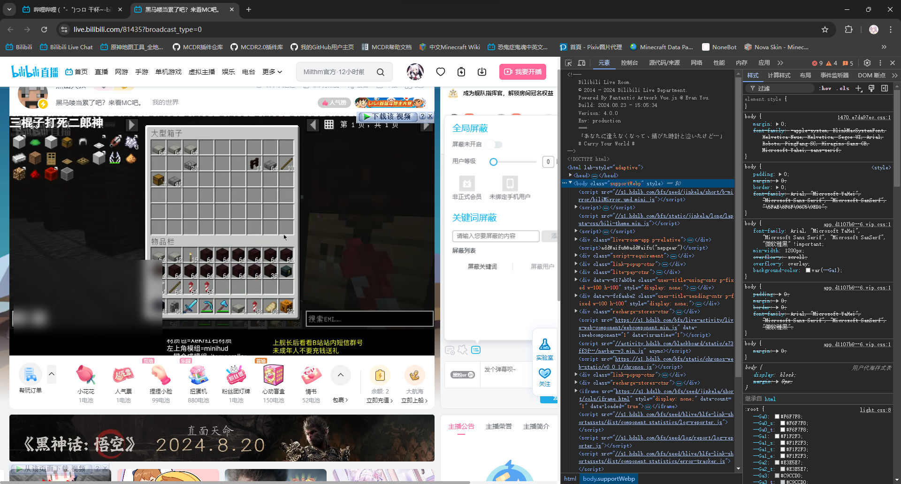
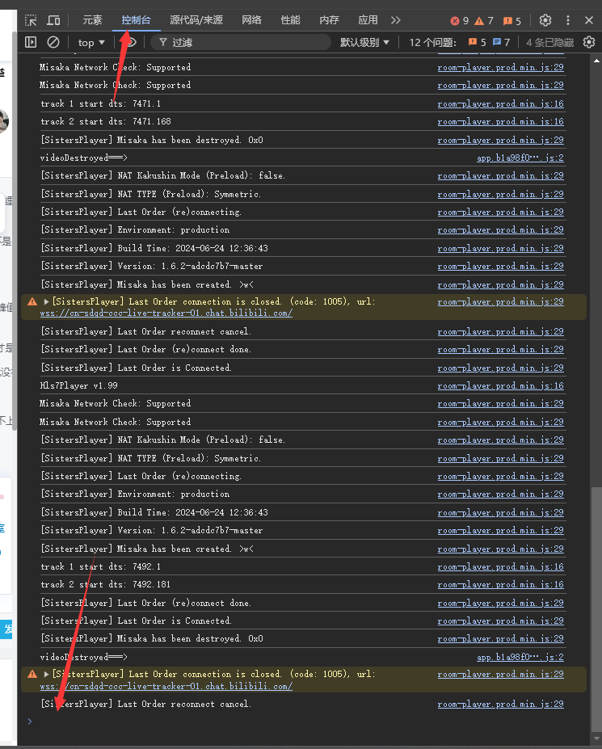
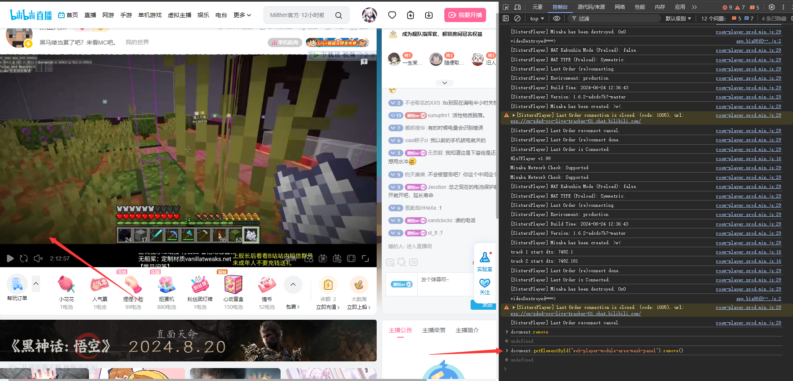
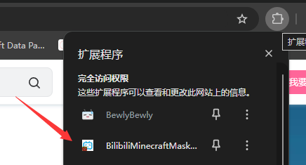
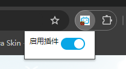

<div align="center">

# 去除B站MC直播左下角马赛克的几种方法

</div>

---

## 方式一 - 使用浏览器F12调试台
> 该方法一次性, 不建议使用
> 以Google Chrome为例

- 使用F12呼出浏览器控制台后 如图



- 点击控制台选项, 然后在图片所指的地方输入这串代码
```
document.getElementById("web-player-module-area-mask-panel").remove()
```



- 点击回车之后你就会发现马赛克消失了!



---

## 方法二 - 使用浏览器插件 (推荐)
> 这里动空写了一个提供给Chrome的(毕竟咱一般Chrome用的多)

> 非官方插件的安装方法自行寻找

插件下载地址:
[蓝奏云](https://wwks.lanzouj.com/iH9jp2886mna)

- 安装完成后点击这里的按钮



- 点击`启用插件`后面的按钮后, 刷新页面, 就会发现马赛克消失了



---

## 方法三 - 使用油猴插件 (推荐)
> 十分好用!!!十分推荐!!!

## 油猴安装方式:
### 方法一 - 商店下载
- Chrome
[访问谷歌插件商店](https://chromewebstore.google.com/detail/gcalenpjmijncebpfijmoaglllgpjagf) (需要科学上网)
- Microsoft Edge
[访问Edge插件商店](https://microsoftedge.microsoft.com/addons/detail/tampermonkey/iikmkjmpaadaobahmlepeloendndfphd)
- Firefox
[访问FireFoxAddons](https://addons.mozilla.org/zh-CN/firefox/addon/tampermonkey/)
### 方法二 - Crx手动安装
- crx:
下载链接: [蓝奏云](https://wwks.lanzouj.com/idkqN2889s2d) 密码: b1sb  
> CRX安装方式自行按需搜索, 本篇不再赘述

### 安装插件
> 这里使用的是古镇天的工具包

插件地址: https://greasyfork.org/zh-CN/scripts/493486-%E5%8F%A4%E9%95%87%E5%A4%A9%E7%9A%84b%E7%AB%99%E5%B7%A5%E5%85%B7%E5%8C%85  
插件会默认开启  
安装完成之后回到直播间并且刷新, 就会发现马赛克消失了!

